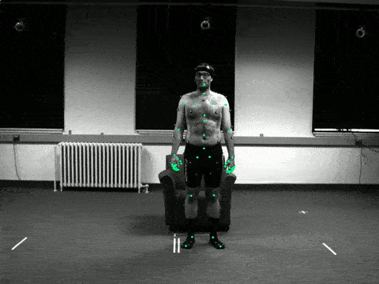

# MoVi Dataset Toolkit
The project which uses the [MoVi dataset](https://www.biomotionlab.ca/movi/) as the main source.



## Project Structure
* [common](../common) - common functions used across the project.
* [data](../data) - dataset folder (instruction of placing the data is in this folder).
* [data_player](../data_player) - functionality for visualizing MoVi dataset.

## Installation
From the root directory, run this command:
```bash
python setup.py install --user
```

## Development
When are you in the development mode, use this command:
```bash
python setup.py install develop --user
```

## Todo
* Make converter for MoVi dataset that it would be easy to use in ML projects.
* Train a model with MoVi dataset.
