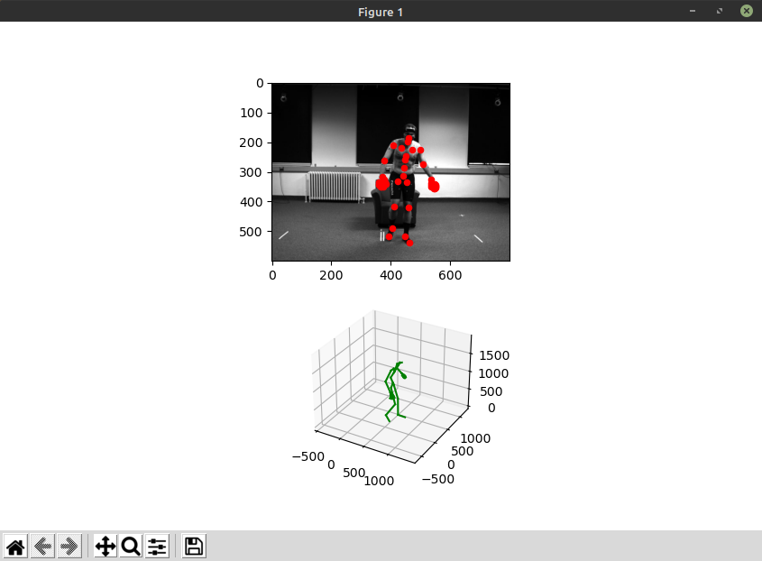

# data_player


Data player helps to visualize MoVi motion capture files in Python.

```
usage: player.py [-h] [--extrinsic_data EXTRINSIC_DATA] [--camera_data CAMERA_DATA] [--motion_capture_data MOTION_CAPTURE_DATA] [--movement_number MOVEMENT_NUMBER] [--video_file VIDEO_FILE] [--output_video_file OUTPUT_VIDEO_FILE]

optional arguments:
  -h, --help            show this help message and exit
  --extrinsic_data EXTRINSIC_DATA
                        Path to the camera's extrinsic parameters.
  --camera_data CAMERA_DATA
                        Path to the camera's parameters file.
  --motion_capture_data MOTION_CAPTURE_DATA
                        Path to the motion capture file.
  --movement_number MOVEMENT_NUMBER
                        Number of the AMASS subject movement (starting from 1).
  --video_file VIDEO_FILE
                        Path to the video file.
  --output_video_file OUTPUT_VIDEO_FILE
                        Path to the output video file (e.g., ../output/output.avi).
```
